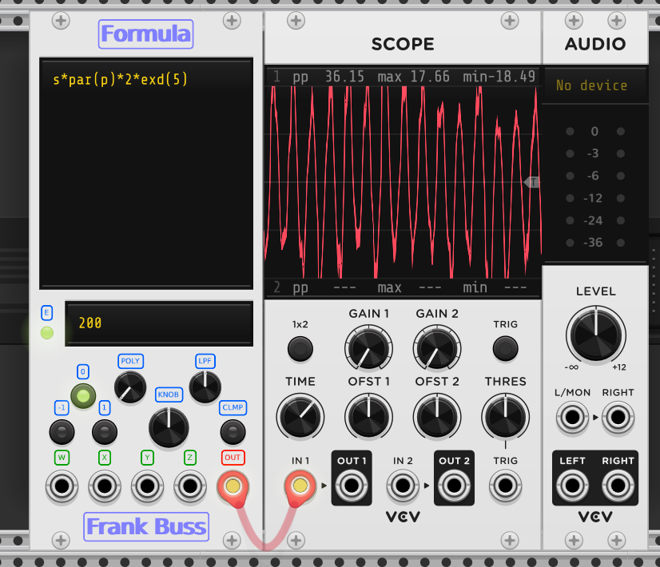

# Documentation and Features

Experimental nightly builds are available, but the date and commit hash is shown on
the asset `.vcvplugin` download files. Ignore the `Nightly Build` "release" date and
commit hash, the downloadable `.vcvplugin` file is more upto date. I think this is
a "feature" of the build script by `baconpaul` (with edits by me).

**No Mac builds yet.** This is due to needing OS 14 to get a build server from a queue,
and that server then getting a 302 redirect, followed by a 404 on the Rack SDK
download, cancelling the build. Lower versions of MacOS have a queue without end.

This repository contains modules that I like, but are often dormant with some good
ideas in the issues tab. It's not to say that other modules aren't available in the
[VCV Rack Plugin Directory](https://vcvrack.com/plugins), but this repository is a
collection of modules that have been developed further to be more useful.

Apparent simplicity is often the key to a good module. Um, I need to find more ...

# VCV Rack Modules by Varoius People

## Frank Buss

[Formula for CV and audio](docs/formula.md)

### Extras

- [X] new operator
  - [X] added monadic `/` (`/x` is prefixed reciprocal of `x`)
- [X] more audio based functions
  - [X] `par(p)` is for parabolic phase `4*p*(1-p)`
  - [X] `cbrt(x)` is for cube root (a favorite distortion)
- [X] more audio based variables
  - [X] `s` is for suboscillation multiplier (for unipolar signals like `par(p)`)
  - [X] `r` is for sample rate (for slow elders on 22.05 kHz or lower)
- {X} polyphonic awareness and enforced level of operation
  - [X] `c` is for channel number (1 to 16) ... not cookie?
  - [X] `m` is for set poly out (1 to 16) ... ish!
- [X] prior knowledge of itself
  - [X] `f` is for frequency (delayed by one sample)
  - [X] `l` is for 1-pole lowpass filter (delayed by one sample, `f` +/- 4 Octaves)
- [X] queing and unquing FIFO to `PORT_MAX_CHANNELS` (crosstalk)
  - [X] `que(x)` is for queuing (`que` evaluates to `x`)
  - [X] `unq(i)` is for unqueueing (index `i` is tail offset, 0 for tail)
- [X] transistor and diode curves
  - [X] `expm1(x)` is for `exp(x) - 1` (zero-er DC audio bias)
  - [X] `log1p(x)` is for `log(1 + x)` (zero-er DC audio bias)
- [X] random sampling
  - [X] `nor(gain)` is for normal Gaussian noise
  - [X] `uni(gain)` is for uniform distribution (0 to `gain`)
  - [X] `exd(gain)` is for exponential distribution
  - [X] `poi(gain)` is for Poisson distribution
- [X] fast Pade approximation (5/5) with built in `pi`
  - [X] `tanp(x)` is for `tan(pi*x)`
  - [X] `sinp(x)` is for `sin(pi*x)`
  - [X] `cosp(x)` is for `cos(pi*x)`
- [X] fuzzy matching and logic for extending possible instantanious happenstance
  - [X] fuzzy equality/inequality (within 1 V)
  - [X] fuzzy `&` and `|` 
- [ ] general improvements (never finished ...)
  - [X] diabled unnecessary exception code (`NaN`, `Inf` no `if`)
  - [X] optimized and thread safe for the future (and other possible CPUs lacking bus snoop overheads)
  - [X] new front panel layout (text rendered panels for future plugin style conformity)
  - [X] dark panels and minor optimization of the primary colours used
  - [X] LED based glowing parameter labels 
  - [X] 11 HP (free 7 HP of space on me)
- [ ] SIMD branch (compiles, no cigar, the black screen no seen, log files, gdb, ...)

### Notes

This is a modulation source. Using `f` or `l` in the frequency formula (lower text box)
might sometimes be good, but can lead to very high frequencies at large amplitudes.
You are advised to place a lowpass filter after this module if you are listening
to the output directly, as the high-frequency artifacts can be very loud.

Quick shortcut names left: `a`, `d`, `g`, `h`, `i`, `j`, `n`, `o`, `q`, `t`, `u`, `v`.
Then it's capital letters: `A`, `B`, `C`, `D`, `E`, `F`, `G`, `H`, `I`, `J`, `K`, `L`, `M`, `N`, `O`, `P`, `Q`, `R`, `S`, `T`, `U`, `V`, `W`, `X`, `Y`, `Z` (or `_`).
